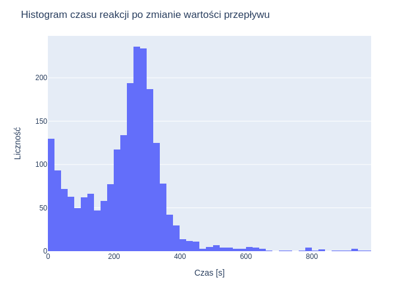
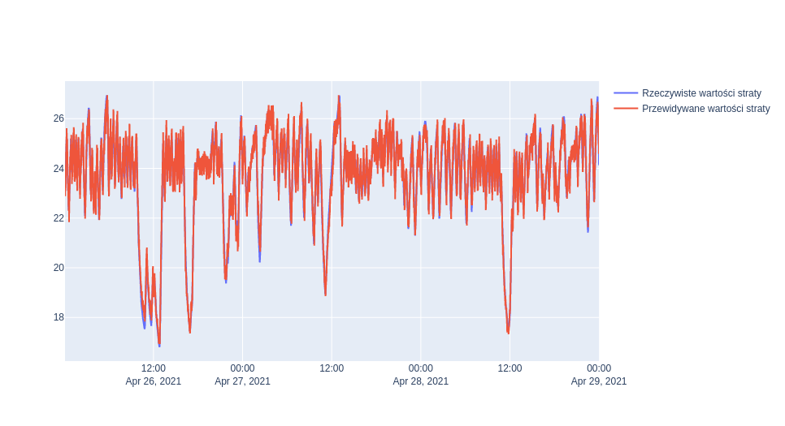
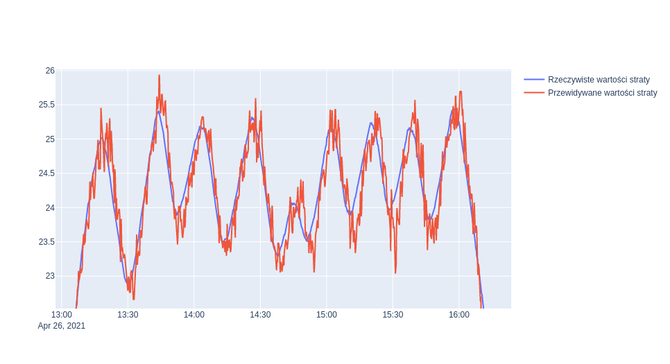

# Górnicy Carla Friedricha Team
> CuValleyHack - stabilizacja pracy pieca zawiesiniowego.

## Spis treści
* [Informacje ogólne](#informacje-ogólne)
* [Nasze rozwiązanie](#nasze-rozwiązanie)
* [ControlRoom - symulacje działania](#symulacje-działania)
* [Contact](#contact)

## Informacje ogólne

> Piec zawiesinowy to serce huty miedzi, które napędza jej działanie. 
Serce to jest niezwykle gorące, dlatego poziom odbioru ciepła w szybie reakcyjnym musi być stale monitorowany oraz stabilizowany. 

**Cel:** Stwórz model empiryczny, który wesprze stabilizację poziomu ciepła w szybie reakcyjnym i usprawni produktywną pracę pieca.

## Nasze rozwiązanie
Nasze rozwiązanie umożliwia automatyczne zarządzanie wartościami zmiennych manipulowanych w celu minimalizacji odchylenia 
łącznych strat cieplnych szybu reakcyjnego od zadanego (predefiniowanego) progu. Stworzony model charakteryzuje się szybkim 
działaniem, dzięki czemu istnieje możliwość zaimplementowania go w czasie rzeczywistym (przy danych spływających co sekundę).
Model może być użyty zarówno do celów diagnostycznych obecnego stanu parametrów pieca zawiesinowego (wsparcie sternika), jak
i do całkowitej automatyzacji procesu doboru zmiennych manipulowanych.  

Nasze podejście można podzielić na cztery etapy:
1. Eksploracyjna analiza danych przeprowadzona w celu zrozumienia problemu oraz sprawdzenia zależności pomiędzy zmiennymi;
2. Preprocessing danych oraz stworzenie dodatkowych zmiennych wejściowych opisujących dynamikę zmian pierwotnych zmiennych;
3. Budowa modelu predykcyjnego estymującego łączne straty KSR w 6-minutowym horyzoncie czasowym;
4. Optymalizacja parametrów manipulowanych w celu osiągnięcia minimalnego odchylenia od zadanej wartości strat KSR w 6-minutowym horyzoncie czasowym.

### 1. Eksploracyjna analiza danych
Najistotniejszym aspektem tej części była analiza rozkładu czasu wystąpowania ekstremów strat KSR po wystąpieniu zmian przepływu 
powietrza dystrybucyjnego. Pozwoliło nam to na znalezienie okresu bezwładności parametru strat. Otrzymany rozkład przentujemy na rysunku poniżej:

Widzimy, że rozkład ten posiada modę w okolicach wartości 300 sekund. Jego średnia wynosi ok. 305 sekund. Oznacza to, że
reakcje zmiennej straty KSR następują średnio dopiero po sześciu minutach po zmianie przepływu powietrza. Tworząc model predykcyjny
skorzystaliśmy z tejże obserwacji (więcej informacji w sekcji dotyczącej modelu predykcyjnego) i znacząco poprawiły jakość modelu. 

### 2. Preprocessing oraz dodanie zmiennych
W celu ograniczenia szumu w danych zastosowaliśmy wygładzanie średnią kroczącą z jednostajnym filtrem 10-sekundowym.
Aby uchwycić dynamikę zmian poszczególnych zmiennych w czasie, użyliśmy numerycznych przybliżeń pierwszej oraz drugiej pochodnej po czasie.
Zmienne te zostały użyte podczas trenowania modelu predykcyjnego.

### 3. Budowa modelu predykcyjnego
Podczas eksploracyjnej analizy danych zauważyliśmy, że efekty zmian parametrów manipulowanych są widoczne z opóźnieniem. 
Z tego względu nasz model został nauczony, w jaki sposób dobierać ich wartości, aby przy obecnych wskaźnikach
otrzymać wartości strat najbliższe zadanym (w horyzoncie 6 minutowym). Pierwszym krokiem do osiągnięcia tego celu było wytrenowanie
wielowymiarowej regresji liniowej, która na podstawie obecnych wartości zmiennych przewidywała wartość strat KSR za 6 minut.
Na podstawie wartości predykcji byliśmy w stanie przeszukiwać przestrzeń możliwych parametrów manipulacyjnych, minimalizujących
różnicę pomiędzy wartością predykcji a zadanym poziomem strat. Nasz model predykcyjny przetestowaliśmy na danych z dni 26.04 - 29.04, 
naszą funkcją straty był błąd średniokwadratowy. Jakość naszego modelu porównaliśmy z modelem "naiwnym", czyli takim, który zawsze
przewidywał obecną wartość strat KSR oraz z modelem nie zawierającym zmiennych z przybliżonymi pochodnymi. Wyniki prezentujemy w tabeli poniżej:

| Model       | Wartość błędu średniokwadratowego |
| ------------- |:-------------:|
| Bazowy (naiwny)     | 0.454 |
| Regresja liniowa (bez pochodnych) | 0.398      |   
| Regresja liniowa (z pochodnymi) | 0.102   |

Z tabeli widzimy, że końcowy model był istotnie lepszy od bazowych. Sprawdźmy, w jaki sposób wyglądały przewidywania modelu:

Powyższy rysunek przedstawia predykcję za cały okres testowy. Aby zobaczyć więcej szczegółów, sprawdźmy okres 26 kwietnia w godzinach 13:00 do 16:00:

Z rysunku widać, że model jest w stanie poprawnie przewidywać zmiany trendu strat KSR, a jego wartości oscylują wokół rzeczywistych.
 

### 4. Optymalizacja parametrów
Lekkość modelu regresji liniowej umożliwia nam szybkie przeszukanie przestrzeni możliwych wartości parametrów manipulowanych oraz wybranie tych,
które dadzą najmniejsze odchylenie od optymalnej wartości. W celu optymalizacji parametrów użyliśmy pythonowej biblioteki optuna.
Zakres przeszukiwanych parametrów:
* Przepływ powietrza dystrybucyjnego - [1900, 3500][Nm^3/h] przy maksymalnej prędkości zmiany 80[Nm^3/h] na sekundę;
* Zawartość tlenu w dmuchu procesowym - [65 - 81] [%] przy maksymalnej prędkości zmiany 0.8[%] na minutę;
* Prędkość dmuchu - [40 - 70] [m/s] przy maksymalnej prędkości zmiany 2[m/s] na sekundę;
* Nadawa pyłów procesowych - jednorazowe obniżenie na 5 minut do minimum 13 [Mg/h].

## Symulacje działania

Poza samym mechanizmem sterowania parametrami manipulacyjnymi wystawionym w postaci RESTapi, przygotowaliśmy również symulator który odpytuje w czasie rzeczywistym nasz algorytm korzystając z danych historycznych. Wyniki przedstawiane przez symulator działania pozwalają ocenić słuszność decyzji podejmowanych przez mechanizm sterujący oraz czas potrzebny na uzyskanie odpowiedzi. Zarówno główna aplikacja, jak i sam symulator, zostały przygotowane wraz z plikami umożliwiającymi ich łatwe uruchomienie. Wykonaj poniższe kroki, aby zobaczyć działanie symulatora na własne oczy!

Uwaga! Poniższa instrukcja zawiera komendy do wpisania w terminalu. Upewnij się, że na Twojej maszynie jest zainstalowany
docker oraz docker-compose. Jeśli nie miałeś/aś jeszcze okazji korzystać to [tutaj](https://docs.docker.com/compose/install/) instrukcja instalacji ;) 

1. Uruchomienie mechanizmu sterującego:
 - cd CuValleyHack/app
 - sudo docker-compose up
2. Uruchomienie ControlRoom'u (rozpoczęcie symulacji):
 - cd CuValleyHack/simulator (w nowym terminalu)
 - sudo docker-compose up

Teraz czas otworzyć paczkę popcorn'u i cieszyć się przewijającymi się przez Twój ekran wynikami symulacji! :D 

Skoro już udało nam się uruchomić nasz mechanizm sterujący to wykorzystamy go żeby pokazać jak działa RESTapi od podszewki i w jaki sposób można użyć go poza symulatorem. Nasz konterer posiada wystawiony port na "0.0.0.0:1234", natomiast interesującą nas funkcje znajdziemy pod nazwą getNewParams/. Pozostaje nam podać parametry z sensorów w danym momencie w czasie. Jest ich łącznie 27 i dla uproszeczenia nazwiemy je zmienna0,...,zmienna26. Korzystając z przeglądarki możemy wysłać zapytanie typu GET do naszego mechanizmu sterującego. Wystarczy w tym celu wkleić poniższy adres URL do przeglądarki.

http://0.0.0.0:1234/getNewParams/?zmienna0=2021-04-19%2000:00:00&zmienna1=1&zmienna2=2&zmienna3=3&zmienna4=4&zmienna5=5&zmienna6=6&zmienna7=7&zmienna8=8&zmienna9=9&zmienna10=10&zmienna11=22&zmienna12=22&zmienna13=22&zmienna14=22&zmienna15=22&zmienna16=22&zmienna17=22&zmienna18=22&zmienna19=22&zmienna20=22&zmienna21=22&zmienna22=22&zmienna23=22&zmienna24=22&zmienna25=22&zmienna26=22

W odpowiedzi dostaliśmy wartości zmian parametrów manipulowalnych jakie powinniśmy wprowadzić.  

## Contact
Created by [Jakub Galik](https://www.linkedin.com/in/jakub-galik-467b6b136/), [Łukasz Łaszczuk](https://www.linkedin.com/in/%C5%82ukasz-%C5%82aszczuk-141361187/), [Robert Benke](https://www.linkedin.com/in/robert-benke-396b56175/) i [Patryk Wielopolski](https://www.linkedin.com/in/patryk-wielopolski/) - masz pytania? Napisz! ;) 
